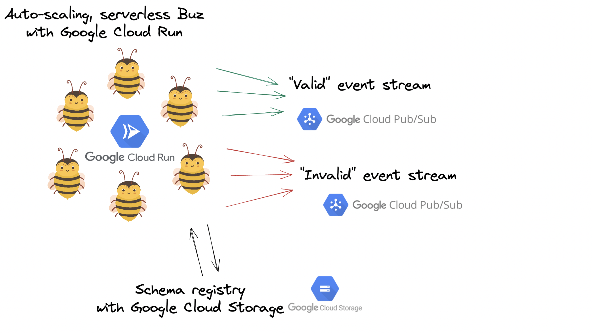
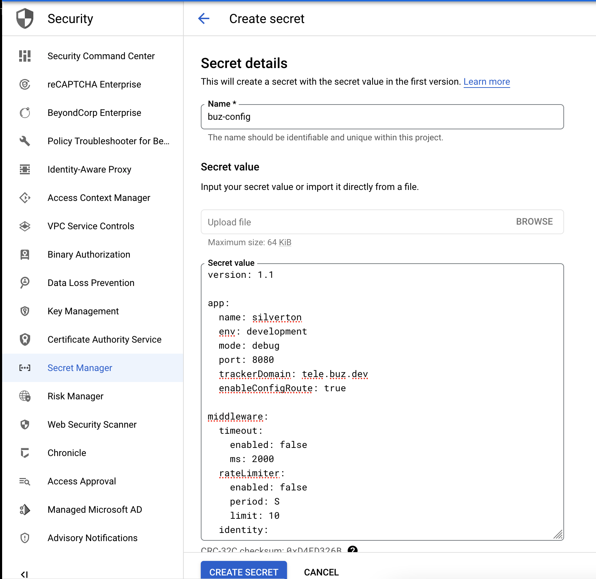
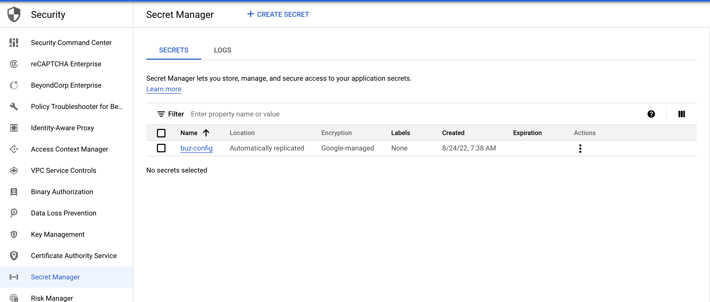
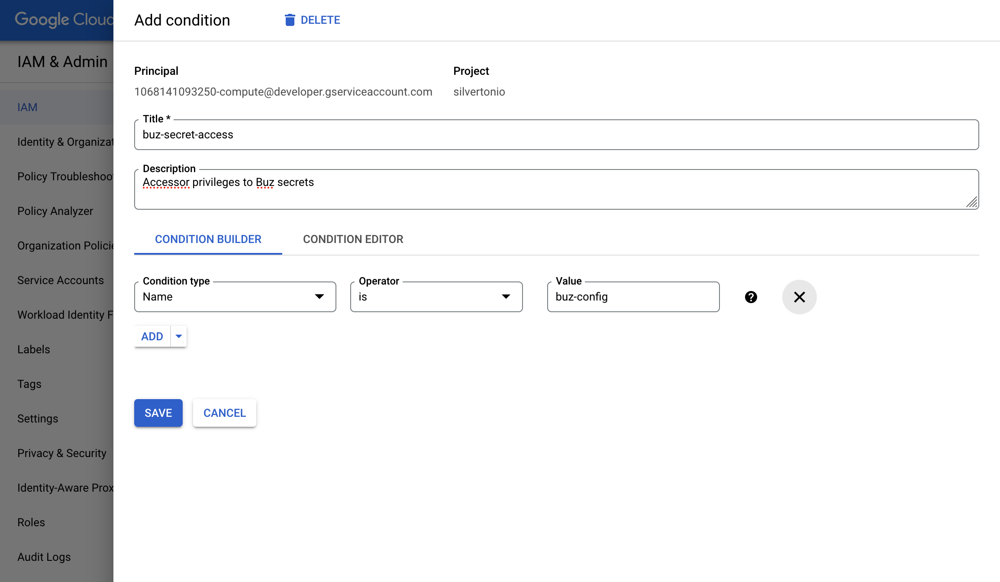
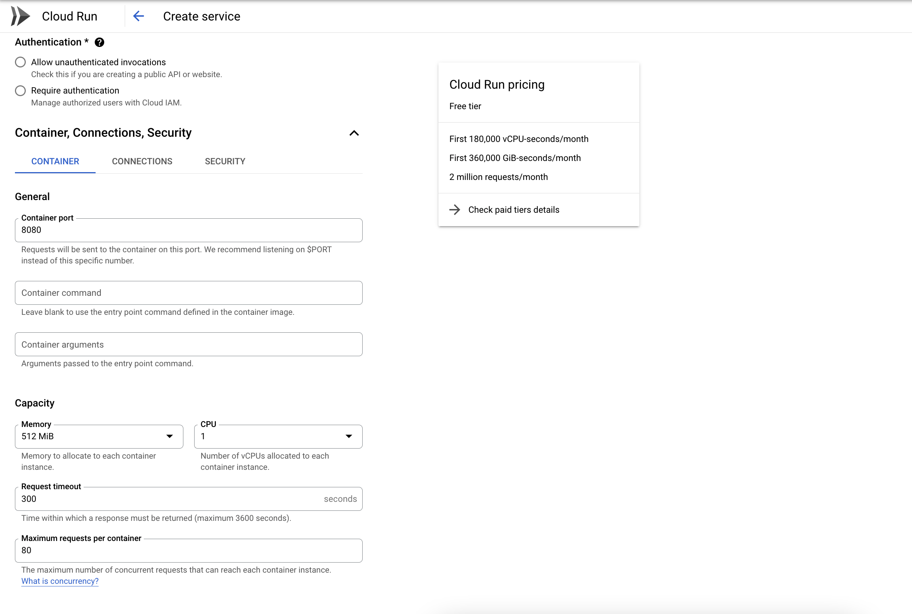
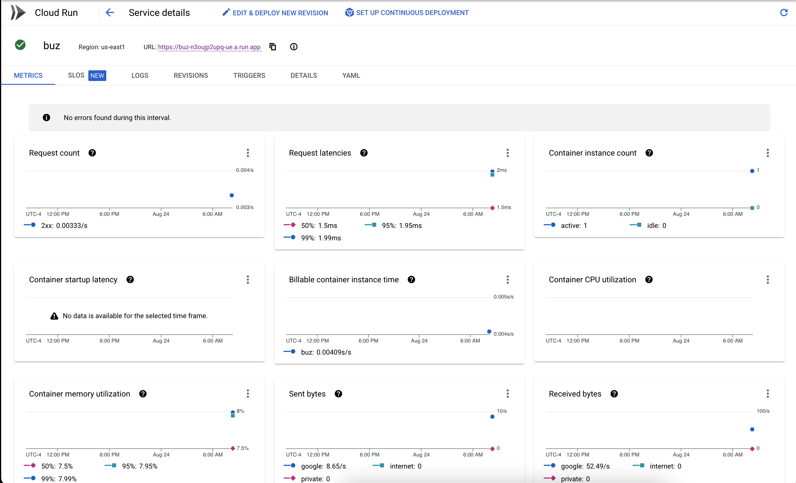
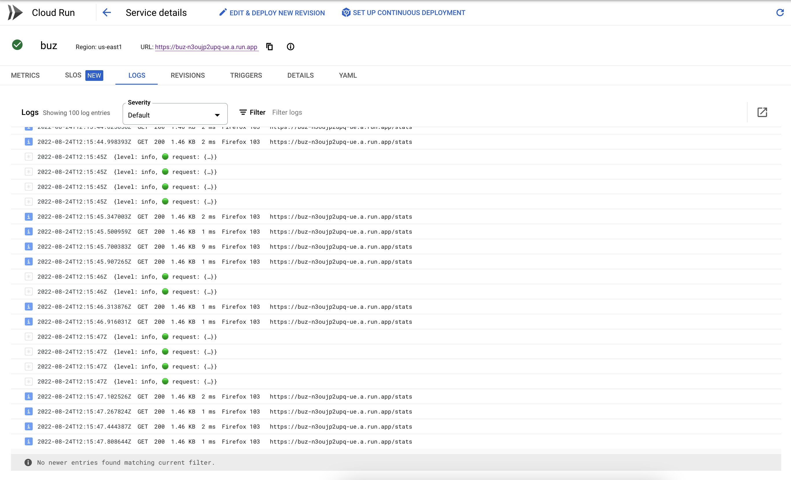
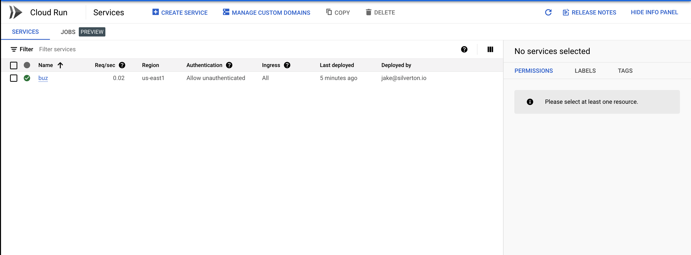
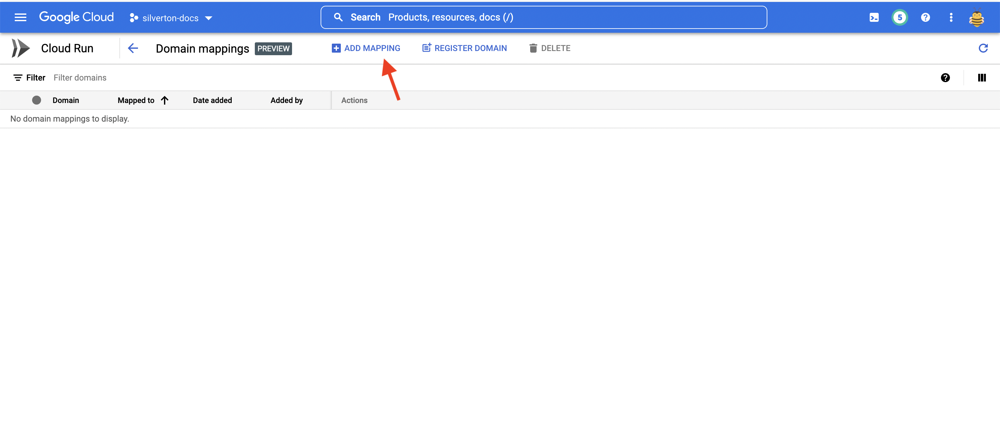
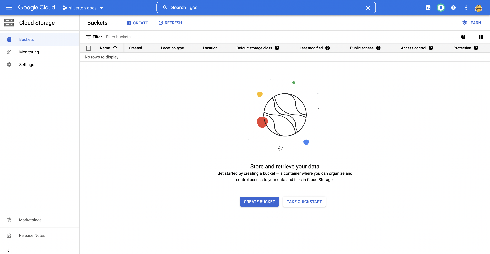

# Deploy Buz to Cloud Run using the GCP Console

**Estimated time: 20 minutes**



## Overview

The easiest way to deploy Buz on GCP is via **[Google Cloud Run](https://cloud.google.com/run)**.

The base deployment consists of **four primary GCP resources** which include:
* **2 Pub/Sub topics for valid and invalid events**
* **1 Secret Manager secret for Buz configuration**
* **1 Cloud Run service for running Buz serverlessly**

It has some pretty nifty benefits such as:

* **Impressive cost efficiences via continuously-autoscaling infrastructure.**
* **Minimal moving pieces to set up and maintain.**
* **Logging and metrics out of the box.**
* **[SLA's](https://cloud.google.com/run/sla) with financial credits from Google if they are broken.**


## Deploy


## 1. Create [Pub/Sub](https://console.cloud.google.com/cloudpubsub/) topics.

**Create `buz-valid` and `buz-invalid` Pub/Sub topics:**


**The result should look like:**


:::info Yo
It is entirely possible to only use one output topic but if you want the upside of redirecting events that fail validation out of the "happy path", two topics are necessary.
:::

***


## 2. Upload config to [Secret Manager](https://console.cloud.google.com/security/secret-manager).

For the sake of keeping your secrets a.. secret.. uploading the entire Buz config yml to Secret Manager is the easiest way forward.

:::info YO
We've provided a working config sample that you can [copy/paste to Secret Manager here](https://github.com/silverton-io/buz-docs/blob/main/examples/deploy/gcp/config.yml).
:::

### Create Buz config as a Secret Manager secret:




**If all is well you'll see:**



### Grant the default compute service account [appropriate iam access](https://console.cloud.google.com/iam-admin/iam). It will need the `Secret Manager Secret Accessor` role:




:::caution Yo
- While this example uses the `default compute service account` you'll probably want to create a dedicated service user.
:::


***


## 3. Push image to GCP [Artifact Registry](https://console.cloud.google.com/artifacts).


### [Create a Docker repository](https://console.cloud.google.com/artifacts/create-repo) in GCP Artifact Registry if you don't have one yet:


**Auth to newly-created registry**

```
gcloud auth configure-docker us-east1-docker.pkg.dev
Adding credentials for: us-east1-docker.pkg.dev
....
Docker configuration file updated.
```

### Pull the latest Buz image from the [Github container registry](https://github.com/silverton-io/buz/pkgs/container/buz):


`docker pull ghcr.io/silverton-io/buz:v0.11.11 --platform linux/amd64`

:::warning AMD64
- At the time of writing Google Cloud Run doesn't support ARM64-based images so you'll need to grab the AMD64 image.
:::

### Tag and push the latest Buz image to Artifact Registry:


**Tag:**

`docker tag ghcr.io/silverton-io/buz:v0.11.11 us-east1-docker.pkg.dev/silverton-docs/registry/buz:v0.11.11`

**Push:**

`docker push us-east1-docker.pkg.dev/silverton-docs/registry/buz:v0.11.11`

:::warning Use your own Artifact Registry URL

This example uses the Silverton registry url - you'll need to use your own.

It's structured as: `$ARTIFACT_REGISTRY_URL/$GCP_PROJECT/$REGISTRY_NAME/buz:$VERSION`
:::

***

## 4. Run Buz as a [Cloud Run](https://console.cloud.google.com/run) service.

### Create a new `Buz` service:





### Verify service is running (using out-of-the-box metrics and logs):






:::caution Yo
- **Log verbosity is cranked in the example configuration.** You'll probably want less.
- **The stdout sink is included for feedback purposes.** You'll probably want to turn it off.
- **The above screenshots are all GCP Cloud Run defaults.** You'll probably want to tune them.
:::

## Bonus Points

### Map a [custom domain](https://cloud.google.com/run/docs/mapping-custom-domains) to Buz

:::warning Yo
While this step is **technically optional**, some Buz functionality like server-side identity cookies ***will not work without it.***
:::

It takes a minute to map a domain/subdomain to a GCP Cloud Run service. Here's how to do it.

**Add mapping:**





**Follow directions to update your dns records:**


***

### Set up a GCS schema registry backend

:::info Yo
- While this step is optional, you'll need to do it when using custom schemas.
- Buz includes an [onboard schema registry](/under-the-hood/registry/overview) that supports many cache backends, so you can just as easily use a different backend.
:::


**Create a GCS bucket for schemas:**




**Copy schemas to the new schema bucket using [gsutil](https://cloud.google.com/storage/docs/gsutil):**


(From [buz](https://github.com/silverton-io/buz) root)
```
buz ❯❯❯ gsutil cp -r schemas/*  gs://$THE_BUCKET_YOU_JUST_CREATED
```

**Reconfigure Buz with a new schema registry backend:**

```
registry:
  backend:
    type: gcs
    bucket: $THE_BUCKET_YOU_JUST_CREATED
    path: /
```

***


### Push events to [BigQuery](https://cloud.google.com/bigquery) using a Pub/Sub Subscription


With the announcment of **[BigQuery Subscriptions](https://cloud.google.com/pubsub/docs/bigquery)** pushing events straight to BigQuery is easier than ever.

**FIXME - document this**

***
