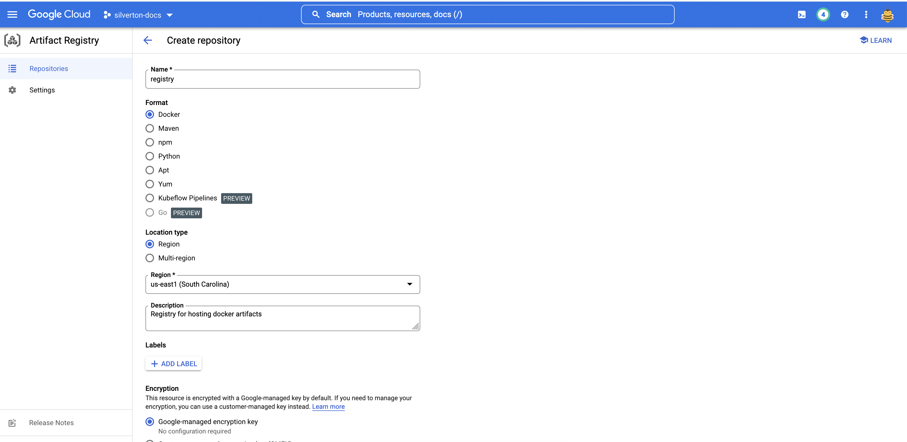
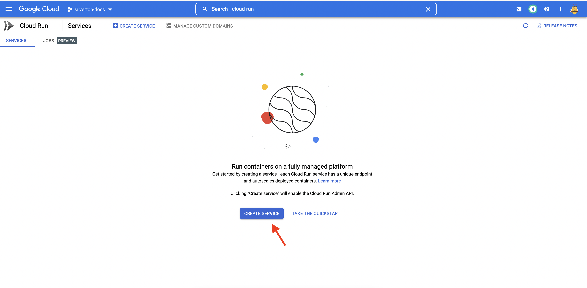
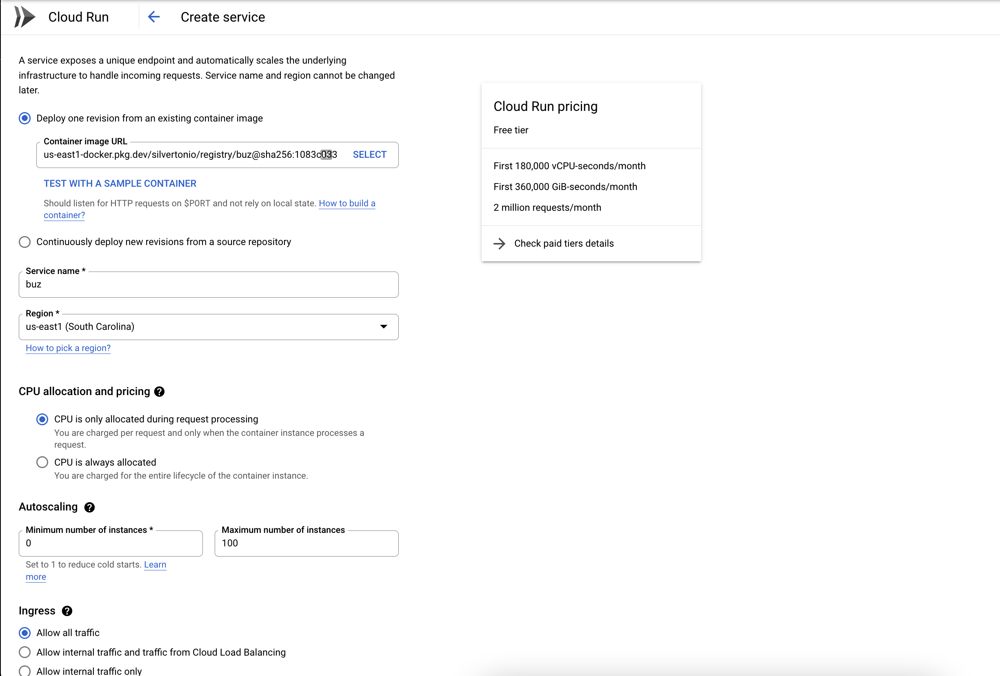
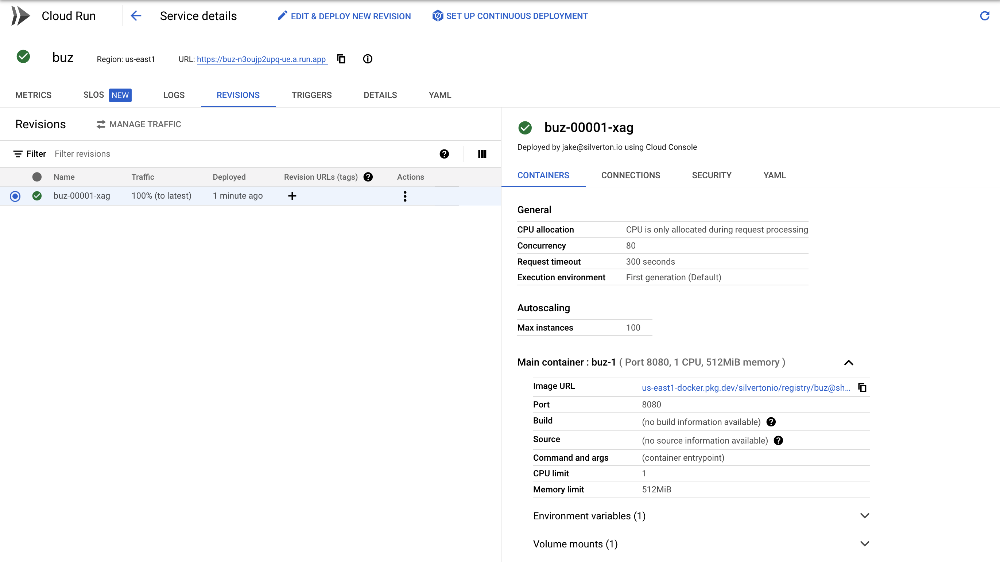
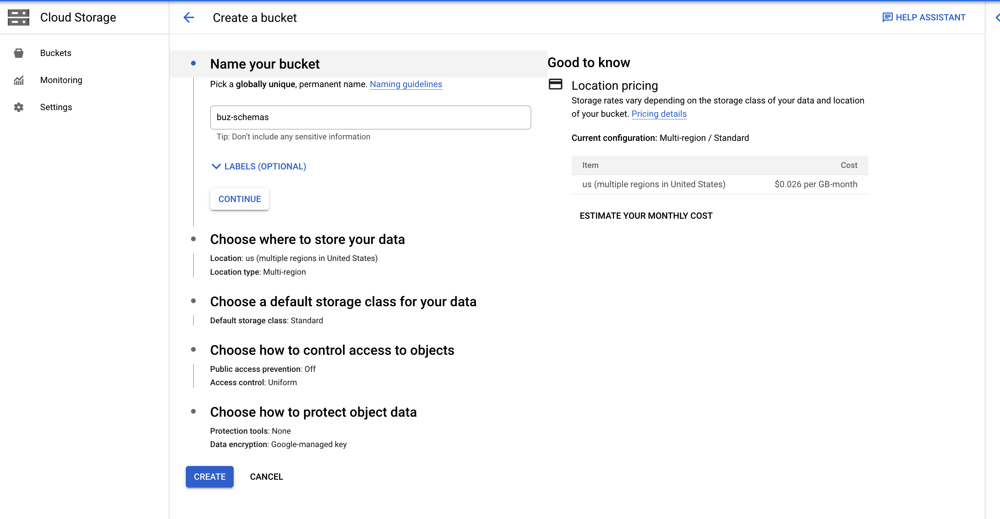

# GCP

## Deploying to Cloud Run (in 4 steps)

The easiest way to deploy Honeypot on GCP is via **[Google Cloud Run](https://cloud.google.com/run)**.

The base deployment consists of **four GCP resources:**
* **Two Pub/Sub topics**
* **One Secret Manager secret (the configuration)**
* **One Cloud Run service**

It has some pretty nifty benefits including:

* **Impressive cost efficiences via continuously-autoscaling infrastructure.**
* **Minimal moving pieces to set up and maintain.**
* **Logging and metrics out of the box.**
* **[SLA's](https://cloud.google.com/run/sla) with financial credits from Google if they are broken.**


### 1. Create [Pub/Sub](https://console.cloud.google.com/cloudpubsub/) topics.

You'll want two Pub/Sub topics - one for `valid` events and the other for `invalid` events.

:::info Yo
It is entirely possible to only use one output topic but if you want the upside of redirecting events that fail validation out of the "happy path", two topics are necessary.
:::

**Create the `honeypot-valid` and `honeypot-invalid` Pub/Sub topics:**


**The result should look like:**


***


### 2. Upload config to [Secret Manager](https://console.cloud.google.com/security/secret-manager).

For the sake of keeping your secrets a.. secret.. uploading the entire Honeypot config yml to Secret Manager is the easiest way forward.

:::info YO
We've provided a working config sample that you can copy/paste to Secret Manager here: **FIXME**
:::

**Create Honeypot config as a Secret Manager secret:**


**If all is well you'll see:**


**Grant the default compute service account [appropriate iam access](https://console.cloud.google.com/iam-admin/iam). It will need the `Secret Manager Secret Accessor` role:**


:::caution Yo
- While this example uses the `default compute service account` you'll probably want to create a dedicated service user.
:::


***


### 3. Push image to GCP [Artifact Registry](https://console.cloud.google.com/artifacts).


**[Create a Docker repository](https://console.cloud.google.com/artifacts/create-repo) in GCP Artifact Registry if you don't have one yet:**



**Auth to newly-created registry**

```
gcloud auth configure-docker us-east1-docker.pkg.dev
Adding credentials for: us-east1-docker.pkg.dev
....
Docker configuration file updated.
```

**Pull the latest Honeypot image from the [Github container registry](https://github.com/silverton-io/honeypot/pkgs/container/honeypot)**:

:::warning AMD64
- At the time of writing Google Cloud Run doesn't support ARM64-based images so you'll need to grab the AMD64 image.
:::

```
docker pull ghcr.io/silverton-io/honeypot:v0.11.10@sha256:26cb7d4ee81c29b26dcb4341c34805fe8edc5cdeb616d819be25688dc115f205 # amd64

ghcr.io/silverton-io/honeypot@sha256:26cb7d4ee81c29b26dcb4341c34805fe8edc5cdeb616d819be25688dc115f205: Pulling from silverton-io/honeypot
Digest: sha256:26cb7d4ee81c29b26dcb4341c34805fe8edc5cdeb616d819be25688dc115f205
Status: Image is up to date for ghcr.io/silverton-io/honeypot@sha256:26cb7d4ee81c29b26dcb4341c34805fe8edc5cdeb616d819be25688dc115f205
ghcr.io/silverton-io/honeypot:v0.11.10@sha256:26cb7d4ee81c29b26dcb4341c34805fe8edc5cdeb616d819be25688dc115f205 # Note! Use applicable version here

v0.11.10: Pulling from silverton-io/honeypot
Digest: sha256:e70de1a6163e7756474c75fc96b6ebb07270bb6940372d348c1ba255f07a67a1
Status: Image is up to date for ghcr.io/silverton-io/honeypot:v0.11.10
ghcr.io/silverton-io/honeypot:v0.11.10
```

**Tag and push the latest Honeypot image to Artifact Registry:**

:::warning Use your own Artifact Registry URL

This example uses the Silverton registry url - you'll need to use your own.

It's structured as: `$ARTIFACT_REGISTRY_URL/$GCP_PROJECT/$REGISTRY_NAME/honeypot:$VERSION`
:::

```
docker tag ghcr.io/silverton-io/honeypot:v0.11.10@sha256:26cb7d4ee81c29b26dcb4341c34805fe8edc5cdeb616d819be25688dc115f205 us-east1-docker.pkg.dev/silverton-docs/registry/honeypot:v0.11.10

docker push us-east1-docker.pkg.dev/silverton-docs/registry/honeypot:v0.11.10
The push refers to repository [us-east1-docker.pkg.dev/silverton-docs/registry/honeypot]
3782d1c64659: Pushed
df4afbed8e0e: Pushed
2ddb525329ee: Pushed
e06c18587270: Pushed
45369456adf2: Pushed
840d11aaaa44: Pushed
20a9c1d833b9: Pushed
v0.11.10: digest: sha256:28d8fda0fb75956a13b33c3cd03e00ab728d65690adfd803d73cc418ef0db1dc size: 1780
```

***

### 4. Run Honeypot as a [Cloud Run](https://console.cloud.google.com/run) service.

**Create a new `Honeypot` service:**






**Verify service is running (using out-of-the-box metrics and logs):**




:::caution Yo
- **Log verbosity is cranked in the example configuration.** You'll probably want less.
- **The stdout sink is included for feedback purposes.** You'll probably want to turn it off.
- **The above screenshots are all GCP Cloud Run defaults.** You'll probably want to tune them.
:::

## Bonus Points

### Map a [custom domain](https://cloud.google.com/run/docs/mapping-custom-domains) to Honeypot

:::warning Yo
While this step is **technically optional**, some Honeypot functionality like server-side identity cookies ***will not work without it.***
:::

It takes a minute to map a domain/subdomain to a GCP Cloud Run service. Here's how to do it.

**Add mapping:**


**Follow directions to update your dns records:**


***

### Set up a GCS schema registry backend

:::info Yo
- While this step is optional, you'll need to do it when using custom schemas.
- Honeypot supports a number of [schema cache backends](/category/schema-cache-backends), so you can just as easily use a different backend.
:::


**Create a GCS bucket for schemas:**




**Copy schemas to the new schema bucket using [gsutil](https://cloud.google.com/storage/docs/gsutil):**


(From [honeypot](https://github.com/silverton-io/honeypot) root)
```
honeypot ❯❯❯ gsutil cp -r schemas/*  gs://$THE_BUCKET_YOU_JUST_CREATED
```

**Reconfigure Honeypot with a new schema registry backend:**

```
schemaCache:
  backend:
    type: gcs
    bucket: $THE_BUCKET_YOU_JUST_CREATED
    path: /
```

***


### Push events to [Bigquery](https://cloud.google.com/bigquery) using a Pub/Sub Subscription


With the announcment of **[Bigquery Subscriptions](https://cloud.google.com/pubsub/docs/bigquery)** pushing events straight to BigQuery is easier than ever.

**FIXME - document this**

***

### Load test the thing

Because it's fun.

**FIXME - document this too**